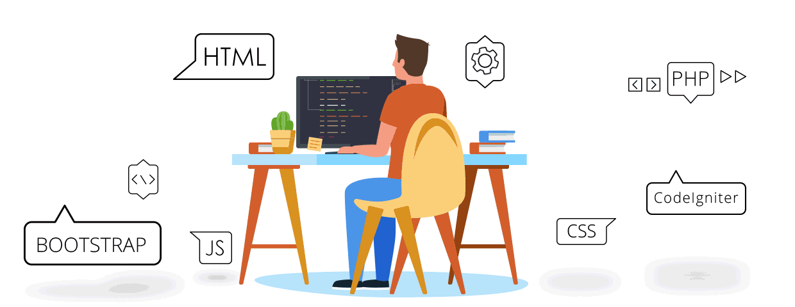

<!-- Banner with Name -->

  
  <h1 style="position: absolute; bottom: 20px; right: 40px; color: white; font-size: 36px;">
    Shivraj Perkar
  </h1>

<h2 align="center">🚀 Aspiring AI/ML Engineer | Full Stack Developer | Problem Solver</h2>

  <b>Final Year Computer Engineering Student at IIIT Nagpur | CGPA: 8.02</b>

---

## 📌 Summary  
Motivated and passionate developer with strong full-stack, AI/ML, and problem-solving skills. Dedicated to building impactful software and solving algorithm challenges.

---

## 📊 GitHub Stats  

  
  

  

  <!-- GitHub Contribution Calendar -->
  

---

## 📊 LeetCode Stats  
📌 **DSA Skills Overview**  
- **Array**: 35 | **Math**: 17 | **Two Pointers**: 13  
- **Hash Table**: 12 | **String**: 10 | **Binary Search**: 9  
- **Dynamic Programming**: 5 | **Backtracking**: 1 | **Divide & Conquer**: 2  

**Total Problems Solved**:  
- **C++**: 48 | **Java**: 15 | **C**: 3  

  
  

---

## 🛠️ Tech Stack  

---

## 🚀 Featured Projects  

### 🍪 [Cookiepedia – AI Cooking Platform](https://github.com/Aurialedge/cookiepedia-vite)  
AI-powered recipe platform with **personalized meal suggestions**, **JWT auth**, and an **AI chatbot**.  

---

### 📈 [Stockie – AI Stock Prediction](https://github.com/Aurialedge/Stockie)  
Stock prediction platform with **LSTM, ARIMA, Regression models**, Flask API, and Power BI dashboards.  

---

### 🚗 [Car Price Predictor](https://github.com/Aurialedge/Car_price_predictor)  
Flask ML app for used car price prediction with **92% accuracy**, deployed on **Heroku**.  

➡️ Explore more: [GitHub Repositories](https://github.com/Aurialedge?tab=repositories)

---

## 🏆 Achievements  
- 🥈 Runner-up — **GPT-3.5 Hackathon**  
- 🥈 Runner-up — **Abacus National Level Competition**  
- 🎯 Active contributor to open-source and hackathons  

---

## 🎓 Education  
**Indian Institute of Information Technology, Nagpur**  
Bachelor of Technology in Computer Science and Engineering  
*Sept 2023 – June 2027 | Current CGPA: 8.02*  

---

## 📫 Connect With Me  

  
  
  
  

---

<!-- Footer -->

  

